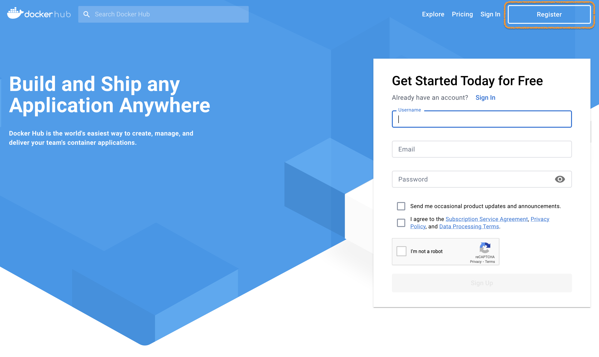
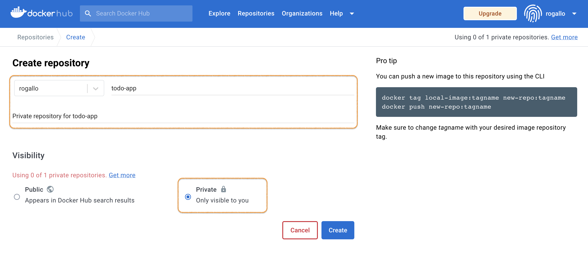
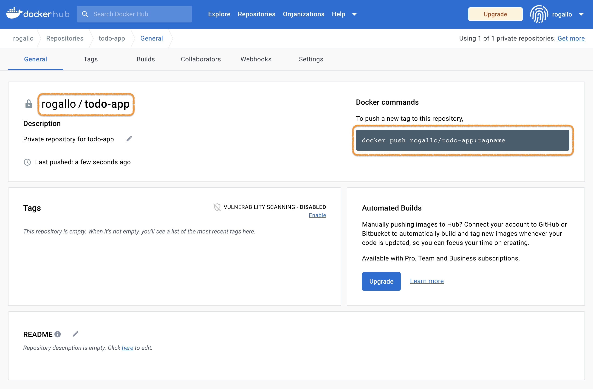
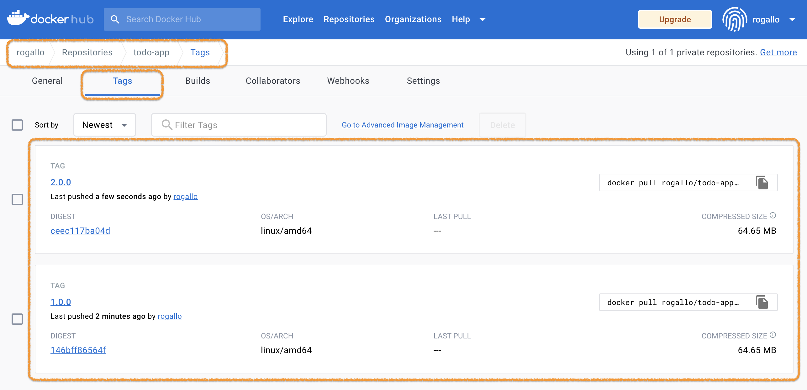

이제 **도커 레지스트리**에 대해 알아보고, 우리가 만든 애플리케이션을 등록해 보겠습니다.

먼저 [https://hub.docker.com/](https://hub.docker.com/) 에 가입(**Register**)을 합니다.

`Register`를 클릭하고, Docker account를 하나 만듭니다. (이미 있으면 있는 Account를 사용해도 됩니다.)

<br><br><br>

이제 실습을 위해서 **Repository**를 하나 생성합니다.  
로그인 후 `Create Repository` 버튼을 클릭해서 시작하면 됩니다.  
이름은 **todo-app** 으로 하고, Visibility는 **Private**으로 합니다.


> 무료 계정인 경우 Private repository는 하나만 만들 수 있습니다.
> 이미 사용중인 Private repository가 있으면, Public으로 만들어도 됩니다.

<br><br><br>

이제 여러분의 Docker repository가 하나 생겼습니다.
앞으로 이 곳에 여러분의 컨테이너 이미지를 저장하고 사용하면 됩니다.


> `[USER-NAME]/[REPOSITORY-NAME]` 이 여러분의 Repository 입니다. (e.g. `rogallo/todo-app`)

<br><br><br>

샘플 애플리케이션 이미지를 만들어 볼까요?  
먼저 소스코드를 Github에서 clone 합니다.
```bash
ubuntu $ git clone https://github.com/JungSangup/todo_list_manager.git app
Cloning into 'app'...
remote: Enumerating objects: 131, done.
remote: Counting objects: 100% (131/131), done.
remote: Compressing objects: 100% (123/123), done.
remote: Total 131 (delta 51), reused 53 (delta 7), pack-reused 0
Receiving objects: 100% (131/131), 1.68 MiB | 16.91 MiB/s, done.
Resolving deltas: 100% (51/51), done.
```

> 💻 명령어 `git clone https://github.com/JungSangup/todo_list_manager.git app`{{exec}}

<br><br><br>

그리고, 소스코드가 있는 경로로 이동합니다.
```bash
ubuntu $ cd app
ubuntu $
```

> 💻 명령어 `cd app`{{exec}}

<br><br><br>

샘플 소스코드에는 두 개의 Tag가 있습니다.
```bash
ubuntu $ git tag
v1.0.0
v2.0.0
```

> 💻 명령어 `git tag`{{exec}}

<br><br><br>

먼저 v1.0.0 이미지를 만듭니다. (`docker build` 명령어을 이용합니다.)  
v1.0.0 tag로 checkout을 하구요,
```bash
ubuntu $ git checkout v1.0.0
Note: switching to 'v1.0.0'.

You are in 'detached HEAD' state. You can look around, make experimental
changes and commit them, and you can discard any commits you make in this
state without impacting any branches by switching back to a branch.

If you want to create a new branch to retain commits you create, you may
do so (now or later) by using -c with the switch command. Example:

  git switch -c <new-branch-name>

Or undo this operation with:

  git switch -

Turn off this advice by setting config variable advice.detachedHead to false

HEAD is now at c7a54f7 .
```

> 💻 명령어 `git checkout v1.0.0`{{exec}}

<br><br><br>

이제 Dockerfile을 이용해서 빌드를 합니다.
```bash
ubuntu $ docker build -t rogallo/todo-app:1.0.0 .
Sending build context to Docker daemon  6.483MB
Step 1/5 : FROM node:10-alpine
10-alpine: Pulling from library/node
ddad3d7c1e96: Pull complete 
de915e575d22: Pull complete 
7150aa69525b: Pull complete 
d7aa47be044e: Pull complete 
Digest: sha256:dc98dac24efd4254f75976c40bce46944697a110d06ce7fa47e7268470cf2e28
Status: Downloaded newer image for node:10-alpine
 ---> aa67ba258e18
Step 2/5 : WORKDIR /app
 ---> Running in eed0ce4ec722
Removing intermediate container eed0ce4ec722
 ---> 7e27e0045fa5
Step 3/5 : COPY . .
 ---> 1f73690ac469
Step 4/5 : RUN yarn install --production
 ---> Running in 3f9a9c4b512e
yarn install v1.22.5
[1/4] Resolving packages...
[2/4] Fetching packages...
info fsevents@1.2.9: The platform "linux" is incompatible with this module.
info "fsevents@1.2.9" is an optional dependency and failed compatibility check. Excluding it from installation.
[3/4] Linking dependencies...
[4/4] Building fresh packages...
Done in 14.57s.
Removing intermediate container 3f9a9c4b512e
 ---> 50d45c1fc2cc
Step 5/5 : CMD ["node", "/app/src/index.js"]
 ---> Running in 65d33484b421
Removing intermediate container 65d33484b421
 ---> 8c87e727699a
Successfully built 8c87e727699a
Successfully tagged rogallo/todo-app:1.0.0
```

> 💻 명령어 `docker build -t [USER-NAME]/todo-app:1.0.0 .`{{copy}}  
> [USER-NAME] 에는 여러분의 정보로 채워넣어 주세요.

<br><br><br>

이제 v2.0.0 이미지를 만듭니다.  
v2.0.0 tag로 checkout을 하구요,
```bash
ubuntu $ git checkout v2.0.0
Previous HEAD position was c7a54f7 .
HEAD is now at d1c1aaf Update index.html
```

> 💻 명령어 `git checkout v2.0.0`{{exec}}

<br><br><br>

Dockerfile을 이용해서 빌드를 합니다.
```bash
ubuntu $ docker build -t rogallo/todo-app:2.0.0 .
Sending build context to Docker daemon  6.483MB
Step 1/5 : FROM node:10-alpine
 ---> aa67ba258e18
Step 2/5 : WORKDIR /app
 ---> Using cache
 ---> 7e27e0045fa5
Step 3/5 : COPY . .
 ---> 8796a3ff7121
Step 4/5 : RUN yarn install --production
 ---> Running in 01fc400ca7f4
yarn install v1.22.5
[1/4] Resolving packages...
[2/4] Fetching packages...
info fsevents@1.2.9: The platform "linux" is incompatible with this module.
info "fsevents@1.2.9" is an optional dependency and failed compatibility check. Excluding it from installation.
[3/4] Linking dependencies...
[4/4] Building fresh packages...
Done in 15.56s.
Removing intermediate container 01fc400ca7f4
 ---> 6250e45acc89
Step 5/5 : CMD ["node", "/app/src/index.js"]
 ---> Running in b1713415106b
Removing intermediate container b1713415106b
 ---> 3bb351aa18ee
Successfully built 3bb351aa18ee
Successfully tagged rogallo/todo-app:2.0.0
```

> 💻 명령어 `docker build -t [USER-NAME]/todo-app:2.0.0 .`{{copy}}  
> [USER-NAME] 에는 여러분의 정보로 채워넣어 주세요.

<br><br><br>

그리고, 만들어진 이미지를 확인합니다.
```bash
ubuntu $ docker images rogallo/todo-app
REPOSITORY         TAG       IMAGE ID       CREATED          SIZE
rogallo/todo-app   2.0.0     3bb351aa18ee   28 seconds ago   172MB
rogallo/todo-app   1.0.0     8c87e727699a   2 minutes ago    172MB
```

> 💻 명령어 `docker images [USER-NAME]/todo-app`{{copy}}  
> [USER-NAME] 에는 여러분의 정보로 채워넣어 주세요.

<br><br><br>

이제 우리가 만든 이미지를 우리의 Docker hub repository에 업로드(push)해 보겠습니다.
먼저 로그인을 하구요,
```bash
ubuntu $ docker login -u rogallo    
Password: 
WARNING! Your password will be stored unencrypted in /root/.docker/config.json.
Configure a credential helper to remove this warning. See
https://docs.docker.com/engine/reference/commandline/login/#credentials-store

Login Succeeded
```

> 💻 명령어 `docker login -u [USER-NAME]`{{copy}}  
> [USER-NAME] 에는 여러분의 정보로 채워넣어 주세요.

<br><br><br>

아래 명령어로 docker hub의 우리 repository에 업로드(push) 해볼까요?
```bash
ubuntu $ docker push rogallo/todo-app:1.0.0
The push refers to repository [docker.io/rogallo/todo-app]
443bed53fb8e: Pushed 
d8984dc5603f: Pushed 
f33eb61b4a29: Pushed 
edff9ff691d5: Layer already exists 
cbe4b9146f86: Layer already exists 
a6524c5b12a6: Layer already exists 
9a5d14f9f550: Layer already exists 
1.0.0: digest: sha256:bb2e9e4764b2390406e83802cfe8d7356fb19928e8e42f16a0aff1a51ea0e3a0 size: 1788
```

> 💻 명령어 `docker push [USER-NAME]/todo-app:1.0.0`{{copy}}  
> [USER-NAME] 에는 여러분의 정보로 채워넣어 주세요.

<br><br><br>

똑 같은 방법으로 두 번재 이미지도 push합니다.
```bash
ubuntu $ docker push rogallo/todo-app:2.0.0
The push refers to repository [docker.io/rogallo/todo-app]
cc6abe07532b: Pushed 
7099b5c5648c: Pushed 
f33eb61b4a29: Layer already exists 
edff9ff691d5: Layer already exists 
cbe4b9146f86: Layer already exists 
a6524c5b12a6: Layer already exists 
9a5d14f9f550: Layer already exists 
2.0.0: digest: sha256:7fb793356d1adedd2e5031a6d16a99cb40b1208cd864910cac1f323c6b8f1320 size: 1788
```

> 💻 명령어 `docker push [USER-NAME]/todo-app:2.0.0`{{copy}}  
> [USER-NAME] 에는 여러분의 정보로 채워넣어 주세요.

<br><br><br>

[https://hub.docker.com/](https://hub.docker.com/) 에 방금 push한 이미지가 잘 올라가 있나요?


> 위의 두 개 이미지는 뒤의 과정에서 계속 필요하니, 잘 준비해두세요.

<br><br><br>

축하합니다.  (๑˃̵ᴗ˂̵)و

이제 여러분들의 저장공간도 생겼고, 언제 어디서든 방금 올려둔 이미지를 이용해서 여러분의 샘플 애플리케이션을 실행할 수 있게 됐습니다.  

<br>

이번 실습은 여기까지 입니다. 