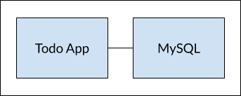

도커 네트워크를 이용해서 아래 그림과 같이 멀티 컨테이너 애플리케이션을 구성해 보겠습니다.
우리 애플리케이션에 Database(MySQL)를 연결해서 서비스하도록 합니다.




먼저 docker network create명령으로 bridge network을 하나 생성하겠습니다.
```bash
ubuntu $ docker network create todo-app
837f0c9042700fe37db8976cd6dbe375b955a9553c9b56eca820cee397860fd1
```

> 💻 명령어 `docker network create todo-app`{{exec}}

<br><br><br>

생성된 Network는 아래와 같이 상세내용을 확인할 수 있습니다.
```bash
ubuntu $ docker network inspect todo-app
[
    {
        "Name": "todo-app",
        "Id": "837f0c9042700fe37db8976cd6dbe375b955a9553c9b56eca820cee397860fd1",
        "Created": "2023-02-27T15:12:44.052379365Z",
        "Scope": "local",
        "Driver": "bridge",
        "EnableIPv6": false,
        "IPAM": {
            "Driver": "default",
            "Options": {},
            "Config": [
                {
                    "Subnet": "172.18.0.0/16",
                    "Gateway": "172.18.0.1"
                }
            ]
        },
        "Internal": false,
        "Attachable": false,
        "Ingress": false,
        "ConfigFrom": {
            "Network": ""
        },
        "ConfigOnly": false,
        "Containers": {},
        "Options": {},
        "Labels": {}
    }
]
```

> 💻 명령어 `docker network inspect todo-app`{{exec}}

<br><br><br>

그리고, 생성한 네트워크를 이용해서 mysql을 실행합니다.
```bash
ubuntu $ docker run -d \
>    --network todo-app --network-alias mysql \
>    --volume todo-mysql-data:/var/lib/mysql \
>    --env MYSQL_ROOT_PASSWORD=secret \
>    --env MYSQL_DATABASE=todos \
>    --env LANG=C.UTF-8 \
>    --name my-mysql \
>    mysql:5.7 \
>    --character-set-server=utf8mb4 \
>    --collation-server=utf8mb4_unicode_ci
Unable to find image 'mysql:5.7' locally
5.7: Pulling from library/mysql
e048d0a38742: Pull complete 
c7847c8a41cb: Pull complete 
351a550f260d: Pull complete 
8ce196d9d34f: Pull complete 
17febb6f2030: Pull complete 
d4e426841fb4: Pull complete 
fda41038b9f8: Pull complete 
f47aac56b41b: Pull complete 
a4a90c369737: Pull complete 
97091252395b: Pull complete 
84fac29d61e9: Pull complete 
Digest: sha256:8cf035b14977b26f4a47d98e85949a7dd35e641f88fc24aa4b466b36beecf9d6
Status: Downloaded newer image for mysql:5.7
e3e9209bf2e06459de6b4f37b2ae75d5b30bdfdeb9b2a8c10537a96ac575b9df
```

> 💻 명령어
>```
>docker run -d \
>    --network todo-app --network-alias mysql \
>    --volume todo-mysql-data:/var/lib/mysql \
>    --env MYSQL_ROOT_PASSWORD=secret \
>    --env MYSQL_DATABASE=todos \
>    --env LANG=C.UTF-8 \
>    --name my-mysql \
>    mysql:5.7 \
>    --character-set-server=utf8mb4 \
>    --collation-server=utf8mb4_unicode_ci
>```{{exec}}

이전에 배운 **volume**도 사용하네요.  
데이터의 영속성을 위해서 데이터는 **volume(todo-mysql-data)**에 저장하도록 구성했습니다.  
`docker volume create`명령으로 생성하지 않아도, 없는 경우엔 도커가 알아서 생성해줍니다. ◟(ˊᗨˋ)◞ 

<br><br><br>

이제 mysql에 로그인해서 데이터베이스가 잘 생성됐나 봅시다.  
```bash
ubuntu $ docker exec -it my-mysql mysql -p
Enter password: 
Welcome to the MySQL monitor.  Commands end with ; or \g.
Your MySQL connection id is 2
Server version: 5.7.41 MySQL Community Server (GPL)

Copyright (c) 2000, 2023, Oracle and/or its affiliates.

Oracle is a registered trademark of Oracle Corporation and/or its
affiliates. Other names may be trademarks of their respective
owners.

Type 'help;' or '\h' for help. Type '\c' to clear the current input statement.

mysql>
```

> 💻 명령어 `docker exec -it my-mysql mysql -p`{{exec}}
- Password는 **secret**입니다.  

**mysql>** 프롬프트가 표시되면, 정상적으로 로그인 된겁니다.

<br><br><br>

이제 mysql 명령어로 database를 조회해볼까요?
```bash
mysql> show databases;
+--------------------+
| Database           |
+--------------------+
| information_schema |
| mysql              |
| performance_schema |
| sys                |
| todos              |
+--------------------+
5 rows in set (0.00 sec)
```

> 💻 명령어 `show databases;`{{exec}}

**todos**라는 database가 보이시나요?  


<br><br><br>

이제 mysql 에서 나갈게요.
```bash
mysql> exit
Bye
ubuntu $
```

> 💻 명령어 `exit`{{exec}}

<br><br><br>

이번에는 우리의 샘플 애플리케이션을 mysql과 연계해서 실행해 보겠습니다.
- Private repository의 이미지를 사용할 경우 로그인(`docker login -u [USER-NAME]`)이 필요합니다.
```bash
ubuntu $ docker run -dp 3000:3000 --network todo-app --env MYSQL_HOST=mysql --env MYSQL_USER=root --env MYSQL_PASSWORD=secret --env MYSQL_DB=todos --name my-todo-manager rogallo/todo-app:1.0.0
Unable to find image 'rogallo/todo-app:1.0.0' locally
1.0.0: Pulling from rogallo/todo-app
ddad3d7c1e96: Pull complete 
de915e575d22: Pull complete 
7150aa69525b: Pull complete 
d7aa47be044e: Pull complete 
aeb9ad382500: Pull complete 
48e2644522da: Pull complete 
8e2fea53823f: Pull complete 
Digest: sha256:bb2e9e4764b2390406e83802cfe8d7356fb19928e8e42f16a0aff1a51ea0e3a0
Status: Downloaded newer image for rogallo/todo-app:1.0.0
cc8934b424da11f3b4e3033fe9600d7a3d1649db6485a8498aed7aaae35f3dd3
```

> 💻 명령어 `docker run -dp 3000:3000 --network todo-app --env MYSQL_HOST=mysql --env MYSQL_USER=root --env MYSQL_PASSWORD=secret --env MYSQL_DB=todos --name my-todo-manager [USER-NAME]/todo-app:1.0.0`{{copy}}  
> [USER-NAME] 에는 여러분의 정보로 채워넣어 주세요.  
- **[USER-NAME]/todo-app:1.0.0** 이 준비가 안된 경우, **rogallo/101-todo-app:1.0.0**을 이용해주세요. login 없이 사용가능한 public repository의 이미지입니다.

`--network`옵션으로 mysql과 동일한 네트워크로 설정했고,  
`--env`를 이용해서 mysql 연계에 필요한 환경변수들을 설정해 주었습니다.

<br><br><br>

우리 애플리케이션의 로그를 한 번 볼까요?  
```bash
ubuntu $ docker logs my-todo-manager
Waiting for mysql:3306.
Connected!
Connected to mysql db at host mysql
Listening on port 3000
```

> 💻 명령어 `docker logs my-todo-manager`{{exec}}

**mysql**과 잘 연결됐다는 로그(Connected to mysql db at host mysql)가 보이네요.

이제 실행된 애플리케이션에 접속하고 오늘 할 일을 몇 개 적어볼까요?  

🔗 [ToDo List Manager]({{TRAFFIC_HOST1_3000}})


<br><br><br>

자, 이제 다시 mysql로 로그인해서 table에 잘 저장되어 있나 확인해 보겠습니다.  
```bash
ubuntu $ docker exec -it my-mysql mysql -p todos
Enter password: 
Reading table information for completion of table and column names
You can turn off this feature to get a quicker startup with -A

Welcome to the MySQL monitor.  Commands end with ; or \g.
Your MySQL connection id is 5
Server version: 5.7.41 MySQL Community Server (GPL)

Copyright (c) 2000, 2023, Oracle and/or its affiliates.

Oracle is a registered trademark of Oracle Corporation and/or its
affiliates. Other names may be trademarks of their respective
owners.

Type 'help;' or '\h' for help. Type '\c' to clear the current input statement.

mysql>
```

> 💻 명령어 `docker exec -it my-mysql mysql -p todos`{{exec}}  
- Password는 **secret**입니다.  

<br><br><br>

`mysql>`프롬프트가 나오면 아래 쿼리문으로 조회해보세요.

```bash
mysql> select * from todo_items;
+--------------------------------------+---------------------------+-----------+
| id                                   | name                      | completed |
+--------------------------------------+---------------------------+-----------+
| adb328a5-9fab-47b8-9b81-4937ffea0a24 | 도커 공부하기             |         1 |
| b0a2d37e-413b-4bdc-8270-df5a0204446f | 정국이랑 저녁식사         |         0 |
| 817d89a7-4d43-4a6d-a6ba-4ef0e69b9b53 | 장보기                    |         0 |
+--------------------------------------+---------------------------+-----------+
3 rows in set (0.00 sec)
```  

> 💻 명령어 `select * from todo_items;`{{exec}}


화면에서 입력한 오늘의 할 일이 todo_items table에 잘 저장되어 있나요?

`exit` 명령으로 나와주시구요.  
> 💻 명령어 `exit`{{exec}}

사용된 컨테이너를 정리하겠습니다.
```bash
ubuntu $ docker rm -f my-todo-manager my-mysql
my-todo-manager
my-mysql
```

> 💻 명령어 `docker rm -f my-todo-manager my-mysql`{{exec}}

<br><br>

여기까지 실습을 마치겠습니다.  ˘◡˘
