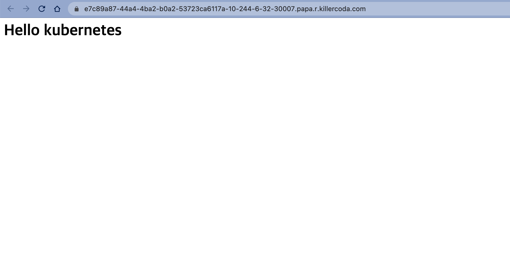

이제 만들어진 PVC, PV를 사용하는 Pod를 생성해 보겠습니다.  

다음과 같이 Deployment를 준비해주세요.
```yaml
apiVersion: apps/v1
kind: Deployment
metadata:
  name: my-nginx-deployment
  labels:
    app: my-nginx
    tier: frontend
spec:
  replicas: 3
  strategy:
    type: RollingUpdate
  selector:
    matchLabels:
      app: my-nginx
  template:
    metadata:
      labels:
        app: my-nginx
    spec:
      volumes:
      - name: nginx-storage
        persistentVolumeClaim:
          claimName: nginx-pvc
      containers:
      - image: nginx:1.19.3
        name: my-nginx
        ports:
        - containerPort: 80
        volumeMounts:
          - mountPath: "/usr/share/nginx/html"
            name: nginx-storage
```
> 파일명은 **nginx-deployment-volume.yaml**로 합니다.

앞에서 만든 **nginx-pvc**를 사용하고, 컨테이너의 **/usr/share/nginx/html**에 마운트합니다.

<br><br><br>

다음은 Deployment와 앞에서 실습한 Service까지 리소스를 생성해주세요.
```bash
ubuntu@ip-172-31-23-60:~$ kubectl apply -f nginx-deployment-volume.yaml
deployment.apps/my-nginx-deployment created
ubuntu@ip-172-31-23-60:~$ kubectl apply -f nginx-nodeport-service.yaml
service/nginx-nodeport-service created
```

> 💻 명령어
>```bash
>kubectl apply -f nginx-deployment-volume.yaml
>kubectl apply -f nginx-nodeport-service.yaml
>```{{exec}}

<br><br><br>

아직 한 가지 더 할 일이 남았습니다.
```bash
ubuntu@ip-172-31-23-60:~$ echo '<h1>Hello kubernetes</h1>' >> /tmp/hostpath-provisioner/default/nginx-pvc/index.html
```

> 💻 명령어 `echo '<h1>Hello kubernetes</h1>' >> /mnt/data/index.html`{{exec}}

<br>

Nginx에서 보여줄 간단한 **index.html**파일을 하나 만들었습니다.  
혹시 PV의 경로가 다르다면 거기에 맞춰서 해주세요.

* 이 실습은 PVC, PV, Pod의 동작을 살펴보기 위한 것입니다. HostPath유형의 사용상 주의사항은 [hostPath](https://kubernetes.io/ko/docs/concepts/storage/volumes/#hostpath)를 참고하세요.

<br><br><br>

이제 브라우저에서 어떻게 나오나 볼까요?

🔗 [Nginx]({{TRAFFIC_HOST1_30007}})



Pod의 파일시스템에도 위의 내용이 반영되어 있는지도 확인해보세요.
```bash
ubuntu@ip-172-31-23-60:~$ kubectl get pods
NAME                                   READY   STATUS    RESTARTS   AGE
my-nginx-deployment-7cbbdb88f6-8n59s   1/1     Running   0          116s
my-nginx-deployment-7cbbdb88f6-jvvsm   1/1     Running   0          116s
my-nginx-deployment-7cbbdb88f6-w44q8   1/1     Running   0          116s
ubuntu@ip-172-31-23-60:~$ kubectl exec -it my-nginx-deployment-7cbbdb88f6-8n59s -- cat /usr/share/nginx/html/index.html
<h1>Hello kubernetes</h1>
```
> 💻 명령어 `kubectl get pod`{{exec}}
> 💻 명령어 `kubectl exec -it [POD-NAME] -- cat /usr/share/nginx/html/index.html`{{copy}}
> [POD-NAME] 에는 앞에서 조회한 POD중 하나의 이름을 넣어주세요.

<br><br><br>

아래와 같이 사용한 리소스들을 정리해주세요.

```bash
ubuntu@ip-172-31-23-60:~$ kubectl delete -f nginx-ingress.yaml
ingress.networking.k8s.io "my-nginx-ingress" deleted
ubuntu@ip-172-31-23-60:~$ kubectl delete -f nginx-clusterip-service.yaml
service "nginx-clusterip-service" deleted
ubuntu@ip-172-31-23-60:~$ kubectl delete -f nginx-deployment-volume.yaml
deployment.apps "my-nginx-deployment" deleted
ubuntu@ip-172-31-23-60:~$ kubectl delete -f nginx-pvc.yaml
persistentvolumeclaim "nginx-pvc" deleted
```
> 💻 명령어
>```bash
>kubectl delete -f nginx-ingress.yaml
>kubectl delete -f nginx-clusterip-service.yaml
>kubectl delete -f nginx-deployment-volume.yaml
>kubectl delete -f nginx-pvc.yaml
>
>```{{exec}}
