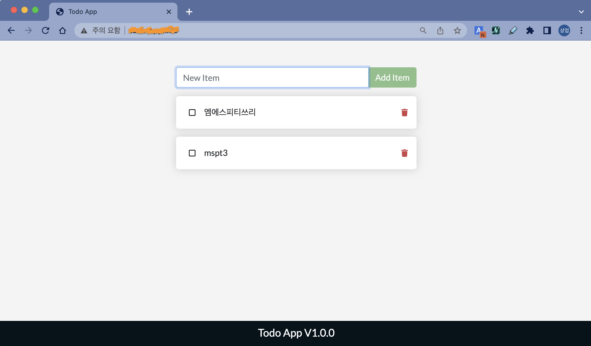
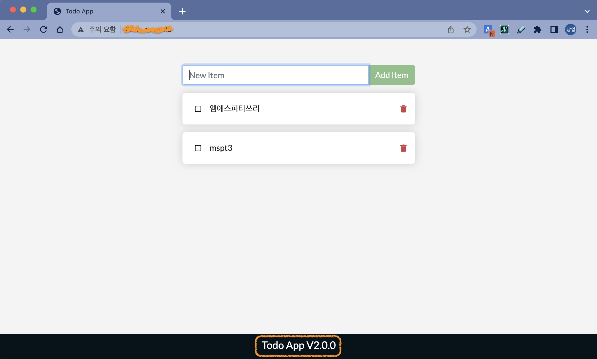

우리가 익숙한 **ToDo App**을 이용해서 좀 더 자세히 볼게요.  
차트는 아래와 같은 구조를 가지고 있습니다. 우리가 배운 여러가지가 다 들어있네요.


<br><br><br>

설치는 간단합니다. 명령어 하나면 끝. （°o°；）
```bash
controlplane $ helm install my-todo-app https://github.com/JungSangup/mspt3/raw/main/hands_on_files/todo-app-1.0.0.tgz
NAME: my-todo-app
LAST DEPLOYED: Sat Mar  4 08:13:33 2023
NAMESPACE: default
STATUS: deployed
REVISION: 1
TEST SUITE: None
NOTES:
1. Get the application URL by running these commands:
  http://todo-app.info/
```

> 💻 명령어 `helm install my-todo-app https://github.com/JungSangup/mspt3/raw/main/hands_on_files/todo-app-1.0.0.tgz`{{exec}}

<br>

위의 방법은 Helm chart 패키지 파일의 URL(깃헙에 올려놓은 파일)을 직접 지정해서 설치한 것입니다.  
위의 방법 외에도 아래와 같은 다양한 방법으로 설치 가능합니다. 
> - `helm install my-todo-app ./todo-app-1.0.0.tgz` -> 로컬 경로의 tgz파일(패키징 된 Helm chart)
> - `helm install my-todo-app ./todo-app` -> 로컬 경로의 차트 디렉토리 

<br><br><br>

우선 이 Helm release는 Uninstall을 할게요. 뒤에 다른 방법으로 다시 설치하겠습니다.
```bash
controlplane $ helm uninstall my-todo-app
release "my-todo-app" uninstalled
```

> 💻 명령어 `helm uninstall my-todo-app`{{exec}}

<br>

정리 후 상태는 아래와 같습니다.
```bash
controlplane $ helm list
NAME    NAMESPACE       REVISION        UPDATED STATUS  CHART   APP VERSION
controlplane $
```

> 💻 명령어 `helm list`{{exec}}

<br><br><br>

이번에는 구성을 조금 달리해서 설치하겠습니다.  
여러분의 **Docker private repository**에 올려놓은 이미지를 사용하도록 하고, 이미지 pull을 위해서 **자격증명**을 사용하도록 할게요.

역시 아래와 같이 간단하게 실행할 수 있습니다.
```bash
controlplane $ helm install my-todo-app \
>     --set image.repository=rogallo/todo-app \
>     --set imageCredentials.create=true \
>     --set imageCredentials.username=rogallo \
>     --set imageCredentials.password=XXXXXX \
>     https://github.com/JungSangup/mspt3/raw/main/hands_on_files/todo-app-1.0.0.tgz
NAME: my-todo-app
LAST DEPLOYED: Sat Mar  4 08:21:31 2023
NAMESPACE: default
STATUS: deployed
REVISION: 1
TEST SUITE: None
NOTES:
1. Get the application URL by running these commands:
  http://todo-app.info/
```

> 💻 명령어
>```bash
>helm install my-todo-app \
>     --set image.repository=[USER-NAME]/todo-app \
>     --set imageCredentials.create=true \
>     --set imageCredentials.username=[USER-NAME] \
>     --set imageCredentials.password=[PASSWORD] \
>     https://github.com/JungSangup/mspt3/raw/main/hands_on_files/todo-app-1.0.0.tgz
>```{{copy}}
> [USER-NAME]과 [PASSWORD]는 여러분의 정보로 채워넣어 주세요. (메모장같은 에디터를 이용해서 수정하고 실행해주세요.)

설치 시점에 아래 키-값 들을 변경해서 적용한 것입니다.  
image.repository는 여러분의 Private repository에서 pull해서 사용하도록 하고, imageCredentials 값들을 이용해서 도커허브 자격증명을 위햔 Secret을 생성합니다.
- image.repository=[USER-NAME]/todo-app
- imageCredentials.create=true
- imageCredentials.username=[USER-NAME]
- imageCredentials.password=[PASSWORD]

<br><br><br>

접속해서 테스트도 해보세요. (NodePort로 접속)

🔗 [ToDo List Manager]({{TRAFFIC_HOST1_30007}})



잘 되나요?

<br><br><br>

생성된 K8s 리소스들도 확인해보세요.
```bash
controlplane $ kubectl get all
NAME                                     READY   STATUS    RESTARTS   AGE
pod/my-todo-app-fb4d789b8-dsspx          1/1     Running   0          82s
pod/my-todo-app-mysql-86bd7f5bc8-5h7dq   1/1     Running   0          82s

NAME                        TYPE        CLUSTER-IP       EXTERNAL-IP   PORT(S)          AGE
service/kubernetes          ClusterIP   10.96.0.1        <none>        443/TCP          8d
service/my-todo-app         NodePort    10.110.253.129   <none>        3000:30007/TCP   82s
service/my-todo-app-mysql   ClusterIP   10.108.6.251     <none>        3306/TCP         82s

NAME                                READY   UP-TO-DATE   AVAILABLE   AGE
deployment.apps/my-todo-app         1/1     1            1           82s
deployment.apps/my-todo-app-mysql   1/1     1            1           82s

NAME                                           DESIRED   CURRENT   READY   AGE
replicaset.apps/my-todo-app-fb4d789b8          1         1         1       82s
replicaset.apps/my-todo-app-mysql-86bd7f5bc8   1         1         1       82s

NAME                                              REFERENCE                TARGETS         MINPODS   MAXPODS   REPLICAS   AGE
horizontalpodautoscaler.autoscaling/my-todo-app   Deployment/my-todo-app   <unknown>/80%   1         10        1          82s
```

> 💻 명령어 `kubectl get all`{{exec}}

<br><br><br>

private repository의 이미지를 pull 하기 위해서 자격증명도 secret으로 생성했습니다.
```base
controlplane $ kubectl describe secrets regcred
Name:         regcred
Namespace:    default
Labels:       app.kubernetes.io/managed-by=Helm
Annotations:  meta.helm.sh/release-name: my-todo-app
              meta.helm.sh/release-namespace: default

Type:  kubernetes.io/dockerconfigjson

Data
====
.dockerconfigjson:  135 bytes
```

> 💻 명령어 `kubectl describe secrets regcred`{{exec}}

<br><br><br>

다른 리소스들 (ConfitMap, Secret, PVC, PV, Ingress) 도 한 번 확인해보세요.
```base
controlplane $ kubectl get configmaps
NAME                 DATA   AGE
kube-root-ca.crt     1      8d
my-todo-app-config   2      2m10s
mysql-config         2      2m10s
controlplane $ kubectl get secrets
NAME                                TYPE                             DATA   AGE
my-todo-app-secret                  Opaque                           2      2m17s
mysql-secret                        Opaque                           1      2m17s
regcred                             kubernetes.io/dockerconfigjson   1      2m17s
sh.helm.release.v1.my-todo-app.v1   helm.sh/release.v1               1      2m17s
controlplane $ kubectl get pvc
NAME                          STATUS   VOLUME                                     CAPACITY   ACCESS MODES   STORAGECLASS   AGE
data-my-wordpress-mariadb-0   Bound    pvc-c4ba2b76-eacb-434b-98b8-844f2d25daef   8Gi        RWO            local-path     9m57s
mysql-pvc                     Bound    pvc-2ea83c79-5490-4059-b21e-1c9c3f08c4a8   3Gi        RWO            local-path     2m23s
controlplane $ kubectl get pv
NAME                                       CAPACITY   ACCESS MODES   RECLAIM POLICY   STATUS   CLAIM                                 STORAGECLASS   REASON   AGE
pvc-2ea83c79-5490-4059-b21e-1c9c3f08c4a8   3Gi        RWO            Delete           Bound    default/mysql-pvc                     local-path              2m26s
pvc-c4ba2b76-eacb-434b-98b8-844f2d25daef   8Gi        RWO            Delete           Bound    default/data-my-wordpress-mariadb-0   local-path              9m58s
controlplane $ kubectl get ingress
NAME          CLASS    HOSTS           ADDRESS   PORTS   AGE
my-todo-app   <none>   todo-app.info             80      2m36s
```

> 💻 명령어
>```bash
>kubectl get configmaps
>```{{exec}}
>```bash
>kubectl get secrets
>```{{exec}}
>```bash
>kubectl get pvc
>```{{exec}}
>```bash
>kubectl get pv
>```{{exec}}
>```bash
>kubectl get ingress
>```{{exec}}

<br><br><br>

이제 Helm 에서 **업그레이드**를 해볼게요.  
여러가지 업그레이드가 있겠지만, 간단히 이미지의 Tag를 변경하는 경우만 해보겠습니다.
```bash
controlplane $ helm upgrade --set image.tag=2.0.0 my-todo-app https://github.com/JungSangup/mspt3/raw/main/hands_on_files/todo-app-1.0.0.tgz
Release "my-todo-app" has been upgraded. Happy Helming!
NAME: my-todo-app
LAST DEPLOYED: Sat Mar  4 10:34:22 2023
NAMESPACE: default
STATUS: deployed
REVISION: 2
TEST SUITE: None
NOTES:
1. Get the application URL by running these commands:
  http://todo-app.info/
```

> 💻 명령어 `helm upgrade --set image.tag=2.0.0 my-todo-app https://github.com/JungSangup/mspt3/raw/main/hands_on_files/todo-app-1.0.0.tgz`{{exec}}  
> **image.tag**만 변경해서 새로운 버젼으로 업그레이드 합니다.

<br><br><br>

바뀐 Deployment도 확인해 보시구요.
이렇게요.
```bash
controlplane $ kubectl describe deployments my-todo-app | grep Image
    Image:      rogallo/101-todo-app:2.0.0
```

> 💻 명령어 `kubectl describe deployments my-todo-app | grep Image`{{exec}}

<br><br><br>

접속해서 테스트도 해보세요. (NodePort로 접속)

🔗 [ToDo List Manager]({{TRAFFIC_HOST1_30007}})



> 구분하기 위해서 하단에 버젼을 표시하도록 해 놓았습니다.

<br><br><br>

롤백도 해볼까요?  
간단히 History를 조회하고, 원하는 **Revision**으로 돌아가면 됩니다.
```bash
controlplane $ helm history my-todo-app
REVISION        UPDATED                         STATUS          CHART           APP VERSION     DESCRIPTION     
1               Sat Mar  4 10:31:07 2023        superseded      todo-app-1.0.0  1.0.0           Install complete
2               Sat Mar  4 10:34:22 2023        deployed        todo-app-1.0.0  1.0.0           Upgrade complete
controlplane $ helm rollback my-todo-app 1
Rollback was a success! Happy Helming!
controlplane $ kubectl describe deployments my-todo-app | grep Image
    Image:      rogallo/todo-app:1.0.0
```

> 💻 명령어
>```bash
>helm history my-todo-app
>```{{exec}}
>```bash
>helm rollback my-todo-app 1
>```{{exec}}
>```bash
>kubectl describe deployments my-todo-app | grep Image
>```{{exec}}

화면도 확인 해 보시구요.  

🔗 [ToDo List Manager]({{TRAFFIC_HOST1_30007}})

<br><br><br>

역시 마지막은 정리.   
아래 명령어로 삭제(Uninstall) 해 주세요.

```bash
controlplane $ helm uninstall my-todo-app
release "my-todo-app" uninstalled
```

> 💻 명령어 `helm uninstall my-todo-app`{{exec}}

<br>

정리 후 상태는 아래와 같습니다.
```bash
controlplane $ helm list
NAME    NAMESPACE       REVISION        UPDATED STATUS  CHART   APP VERSION
controlplane $
```

> 💻 명령어 `helm list`{{exec}}

한꺼번에 설치(install), 업데이트(update), 롤백(rollback), 삭제(uninstall)되니 편하네요.

여기까지 Helm 에 대해 알아보았습니다.

수고하셨습니다. (〃･ิ‿･ิ)ゞ
